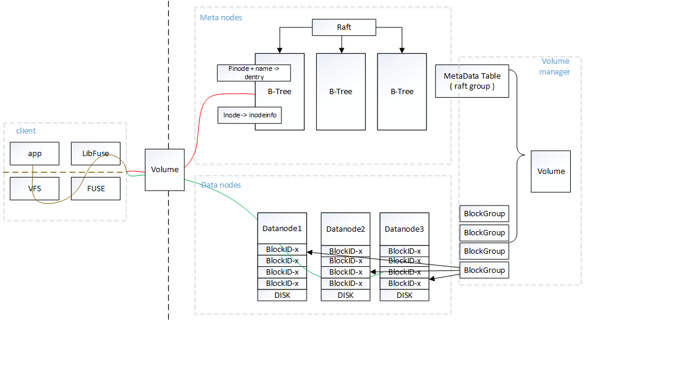

## Containerfs Design

## Architecture

See the later sections for more details of each Containerfs component.

#### Volume  
Volume is a Containerfs instance.  One Containerfs cluster can host millions of volumes.
A volume has one matadata table and unlimited number of block groups

#### Inode  
Inode is a data structure recording the file or directory attributes, indexed with a unique 64bit integer.

#### Matadata Table 
A metadata table is a sorted key-value map from "parent inodeID + name" to inode attributes.
One volume is associated with a metadata table.
Metadata tables are replicated via Raft, and not sharded by design. 

#### Extent
<offset, lenght>

#### Block Group  
Fix-sized replicated storage unit of file extents

#### MetaNode
Hosts one or multiple metadata tables

#### DataNode
Hosts one or multiple block groups

#### Volume Manager  
VolMgr holds all the cluster-level metadata, like the volume space quota, nodes status. 
Data storage options: 1. MGR; 2. replicated VolMgr via Raft.

#### Client
FUSE
Linux kernel

## Communication

## Core Functions

#### cluster startup

#### Volume create
1. Cmdtool or RESTful api create a volume  
2. allocate volumeID, create a volume record in volume-info table  
3. send message to mata node create a new map  
4. allocate a block from block table, update volume record  

#### open I/O flow

#### write I/O flow

#### read I/O flow

## Struct

#### inode
<pre>
&nbsp;InodeDB : map[string]*protobuf.InodeInfo 
&nbsp;// key1 : parentInodeID + name  key2 : string(InodeID)
&nbsp;// 两个key指向同一个value，value是InodeInfo结构体指针
&nbsp;type InodeInfo struct {
&nbsp;        ParentInodeID    int64   `protobuf:"varint,1,opt,name=ParentInodeID" json:"ParentInodeID,omitempty"`
&nbsp;        InodeID          int64   `protobuf:"varint,2,opt,name=InodeID" json:"InodeID,omitempty"`
&nbsp;        Name             string  `protobuf:"bytes,3,opt,name=Name" json:"Name,omitempty"`
&nbsp;        ModifiTime       int64   `protobuf:"varint,4,opt,name=ModifiTime" json:"ModifiTime,omitempty"`
&nbsp;        AccessTime       int64   `protobuf:"varint,5,opt,name=AccessTime" json:"AccessTime,omitempty"`
&nbsp;        InodeType        bool    `protobuf:"varint,6,opt,name=InodeType" json:"InodeType,omitempty"`
&nbsp;        FileSize         int64   `protobuf:"varint,7,opt,name=FileSize" json:"FileSize,omitempty"`
&nbsp;        ChunkIDs         []int64 `protobuf:"varint,8,rep,packed,name=ChunkIDs" json:"ChunkIDs,omitempty"`
&nbsp;        ChildrenInodeIDs []int64 `protobuf:"varint,9,rep,packed,name=ChildrenInodeIDs" json:"ChildrenInodeIDs,omitempty"`
&nbsp;}
</pre>
#### chunk
单独把chunk用map存储，可以实现通过ChunkID快速的反向查找，使用场景比如:chunk副本修复
<pre>
&nbsp;ChunkDB : map[string]*protobuf.ChunkInfo // key : ChunkID
&nbsp;
&nbsp;type ChunkInfo struct {
&nbsp;        ChunkSize  int32        `protobuf:"varint,1,opt,name=ChunkSize" json:"ChunkSize,omitempty"`
&nbsp;        BlockGroupID int32        `protobuf:"varint,2,opt,name=BlockGroupID" json:"BlockGroupID,omitempty"`
&nbsp;        BlockGroup []*BlockInfo `protobuf:"bytes,3,rep,name=BlockGroup" json:"BlockGroup,omitempty"`
&nbsp;}
&nbsp;
&nbsp;type BlockInfo struct {
&nbsp;        BlockID      int32 `protobuf:"varint,1,opt,name=BlockID" json:"BlockID,omitempty"`
&nbsp;        DataNodeIP   int32 `protobuf:"varint,2,opt,name=DataNodeIP" json:"DataNodeIP,omitempty"`
&nbsp;        DataNodePort int32 `protobuf:"varint,3,opt,name=DataNodePort" json:"DataNodePort,omitempty"`
&nbsp;}
</pre>

#### todo

## Volume manager sql tables
<pre>
&nbsp;block table:
&nbsp;blockID | ip | port | status | blockGroupID

&nbsp;volume table:
&nbsp;volumeID | name | spacequota | spaceused | inodequota | inodeused | blockGroupID1 blockGroupID2 blockGroupID3 ... | status
</pre>

